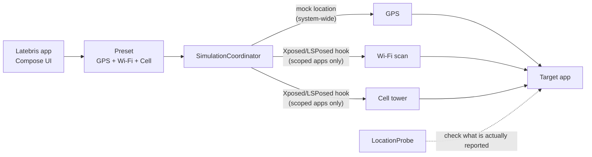

# Latebris

> Android GPS/Wi-Fi/cell spoofing tool — swap location signals as a single preset

[한국어](README.md) · [MIT License](LICENSE) · Android 12+ (minSdk 31) · Kotlin

Most location tools only touch GPS coordinates, so they fall apart in front of apps
that cross-check Wi-Fi scans and cell-tower info. Latebris bundles **GPS, Wi-Fi, and
cell signals into one preset** and changes them together.

**Values change inside the app processes you add to the LSPosed scope — not
system-wide.** Apps outside the scope keep seeing the real Wi-Fi/cell API results.

Built for use on devices you own and apps you are authorized to test.

## Architecture



GPS uses Android's mock-location path, so developer options are enough. Wi-Fi/cell
rewrite the API return values inside the target app process, which requires LSPosed.

## Quick start

```bash
git clone https://github.com/ianlyoo/latebris && cd latebris
./gradlew :app:assembleDebug
adb install app/build/outputs/apk/debug/app-debug.apk
```

For GPS only, set developer options → **Select mock location app** to Latebris and
you're done. For Wi-Fi/cell you need the requirements below.

For device setup start with [How_to_setup_stock_android.md](How_to_setup_stock_android.md),
then follow [How_to_use.md](How_to_use.md) for usage steps.

## Features

| Feature | Description |
|---------|-------------|
| GPS simulation | Injects preset coordinates through Android's mock-location path |
| Wi-Fi spoofing | Hooks `WifiManager.getScanResults` to replace scan results inside the target process |
| Cell spoofing | Hooks `TelephonyManager.getAllCellInfo` / `getCellLocation` to replace LTE cell info |
| Preset management | Bundles GPS/Wi-Fi/cell values into one profile, stored and edited as JSON |
| Device-state capture | Reads the device's real location/Wi-Fi/cell values into a preset draft |
| Cell auto-fill | Looks up real towers around the preset coordinate via OpenCellID |
| Route playback | Moves coordinates along an OpenRouteService route |
| Location probe | Verifies what the target app actually sees |
| Foreground service | Keeps and controls simulation state via a notification |

## Requirements

Requirements differ by scope.

| | GPS only | Including Wi-Fi / Cell |
|---|---|---|
| Device | Android 12+ (real device or emulator) | **Rooted** device or emulator |
| Needs | Developer options + mock-location app | Magisk + LSPosed |
| Permissions | Location (plus notifications on Android 13+) | Same |
| Extra | — | **Add the target app to the LSPosed scope** |

### The LSPosed scope is mandatory

For Wi-Fi/cell values to change, add the **target app to this module's scope** in LSPosed.

- Enabling the module alone is not enough.
- Apps not in the scope keep their original Wi-Fi/cell API results.
- This is by design, not a bug — it confines hooking to the apps you choose.

## Configuration reference

All optional. Supplied as a Gradle property or environment variable, baked into
`BuildConfig` at build time.

| Key | Description |
|---|---|
| `OPEN_ROUTE_SERVICE_API_KEY` | [OpenRouteService](https://openrouteservice.org) key for route playback. Falls back to a built-in route if unset |
| `OPEN_CELL_ID_API_KEY` | [OpenCellID](https://opencellid.org) key for cell auto-fill. Auto-fill is skipped if unset |

```bash
./gradlew :app:assembleDebug -POPEN_CELL_ID_API_KEY=<key> -POPEN_ROUTE_SERVICE_API_KEY=<key>
```

Building a signed release APK requires all four environment variables below.

| Environment variable | Description |
|---|---|
| `ANDROID_SIGNING_STORE_FILE` | keystore file path |
| `ANDROID_SIGNING_STORE_PASSWORD` | keystore password |
| `ANDROID_SIGNING_KEY_ALIAS` | key alias |
| `ANDROID_SIGNING_KEY_PASSWORD` | key password |

## Scope of use

- Use on devices you own or are authorized to test.
- Target apps you are authorized to verify.
- Not an app for general-user distribution.

## Project layout

| Path | Responsibility |
|------|----------------|
| `app/src/main/java/com/example/gpstick/core/gps/` | mock-location injection (`GpsMockRunner`, `LocationMockHook`) |
| `app/src/main/java/com/example/gpstick/core/wifi/` | Wi-Fi scan hook (`WifiScanHook`) |
| `app/src/main/java/com/example/gpstick/core/cell/` | cell info hook (`CellInfoHook`) |
| `app/src/main/java/com/example/gpstick/data/preset/` | preset storage/loading/auto-fill (`JsonPresetStore`, `PresetManager`) |
| `app/src/main/java/com/example/gpstick/service/` | simulation coordination, foreground service, probe, routing |
| `app/src/main/java/com/example/gpstick/hook/ModuleEntryPoint.kt` | Xposed module entry point |
| `app/src/main/java/com/example/gpstick/ui/` | Compose UI |
| `xposed-stubs/` | Xposed API stubs for compilation |

## Development

```bash
./gradlew test              # unit tests
./gradlew connectedCheck    # instrumented tests (device/emulator required)
./gradlew :app:assembleRelease
```

Current version is `0.1.2` (versionCode 3), set in `app/build.gradle.kts`.

## License

[MIT](LICENSE) © 2026 AhnRyu
