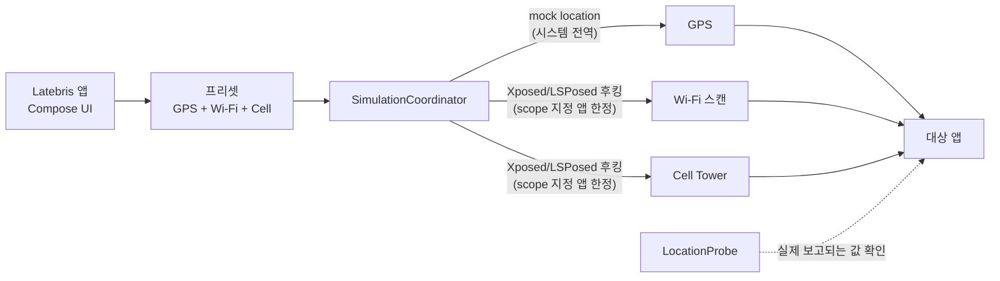

# Latebris

Android location-signal simulation framework for testing applications that consume GPS, Wi-Fi, and cellular location APIs — security research / QA

[English](README.en.md) · [MIT License](LICENSE) · Android 12+ (minSdk 31) · Kotlin

위치를 바꾸는 툴은 대개 GPS 좌표만 건드린다. 그래서 Wi-Fi 스캔 결과나 Cell Tower
정보까지 교차 검증하는 앱 앞에서는 바로 들통난다. Latebris는 **GPS·Wi-Fi·Cell 세 가지
위치 신호를 하나의 프리셋으로 묶어** 함께 바꾼다.

**값이 바뀌는 범위는 시스템 전체가 아니라 LSPosed scope에 넣은 앱 프로세스 안이다.**
scope에 없는 앱은 원래 Wi-Fi/Cell API 결과를 그대로 본다.

본인이 소유한 기기와, 본인이 검증할 권한을 가진 앱을 대상으로 쓰는 것을 전제로 만들었다.

## 아키텍처



GPS는 Android의 mock location 경로를 쓰므로 개발자 옵션만으로 동작한다. Wi-Fi/Cell은
대상 앱 프로세스 안에서 API 반환값을 바꾸는 방식이라 LSPosed가 필요하다.

## 빠른 시작

```bash
git clone https://github.com/ianlyoo/latebris && cd latebris
./gradlew :app:assembleDebug
adb install app/build/outputs/apk/debug/app-debug.apk
```

GPS만 쓸 거라면 여기서 개발자 옵션 → **모의 위치 앱**을 Latebris로 지정하면 끝이다.
Wi-Fi/Cell까지 쓰려면 아래 요구 조건을 채워야 한다.

기기 세팅부터 훑고 싶다면 [How_to_setup_stock_android.md](How_to_setup_stock_android.md)를
먼저 읽고, 사용 순서는 [How_to_use.md](How_to_use.md)를 참고하면 된다.

## 기능

| 기능 | 설명 |
|------|------|
| GPS 시뮬레이션 | Android mock location 경로로 프리셋 좌표를 주입 |
| Wi-Fi 시뮬레이션 | `WifiManager.getScanResults`를 후킹해 대상 앱 프로세스 안에서 스캔 결과를 시뮬레이션 |
| Cell 시뮬레이션 | `TelephonyManager`의 `getAllCellInfo`·`getCellLocation`을 후킹해 LTE 셀 정보를 시뮬레이션 |
| 프리셋 관리 | GPS·Wi-Fi·Cell 값을 한 프로필로 묶어 JSON으로 저장·편집 |
| 기기 상태 캡처 | 현재 기기의 실제 위치·Wi-Fi·Cell 값을 떠서 프리셋 초안으로 사용 |
| Cell 자동 채우기 | OpenCellID로 프리셋 좌표 주변 실제 기지국을 조회해 채움 |
| 라우트 재생 | OpenRouteService 경로를 따라 좌표를 연속 이동 |
| 위치 프로브 | 대상 앱이 실제로 보는 값이 무엇인지 확인 |
| 포그라운드 서비스 | 시뮬레이션 상태를 알림으로 유지·제어 |

## 요구 조건

쓰려는 범위에 따라 조건이 다르다.

| | GPS만 | Wi-Fi / Cell 포함 |
|---|---|---|
| 기기 | Android 12+ (실기기 또는 에뮬레이터) | **루팅된** 기기 또는 에뮬레이터 |
| 필요 | 개발자 옵션 + 모의 위치 앱 지정 | Magisk + LSPosed |
| 권한 | 위치 권한 (Android 13+는 알림 권한도) | 좌동 |
| 추가 | — | **대상 앱을 LSPosed scope에 추가** |

### LSPosed scope 설정은 필수다

Wi-Fi/Cell 값이 바뀌게 하려면 LSPosed에서 **대상 앱을 이 모듈의 scope에 추가**해야 한다.

- 모듈 활성화만으로는 부족하다.
- scope에 추가되지 않은 앱에서는 원래 Wi-Fi/Cell API 결과가 그대로 유지된다.
- 이건 버그가 아니라 설계다 — 후킹 범위를 지정한 앱으로 한정하기 위한 것이다.

## 설정 레퍼런스

전부 선택 사항이다. Gradle property 또는 환경변수로 넣으면 빌드 시 `BuildConfig`에 박힌다.

| 키 | 설명 |
|---|---|
| `OPEN_ROUTE_SERVICE_API_KEY` | 라우트 재생용 [OpenRouteService](https://openrouteservice.org) 키. 미설정 시 내장 fallback 경로를 쓴다 |
| `OPEN_CELL_ID_API_KEY` | Cell 자동 채우기용 [OpenCellID](https://opencellid.org) 키. 미설정 시 자동 채우기를 건너뛴다 |

```bash
./gradlew :app:assembleDebug -POPEN_CELL_ID_API_KEY=<key> -POPEN_ROUTE_SERVICE_API_KEY=<key>
```

서명된 release APK를 빌드하려면 아래 환경변수 4개가 모두 필요하다.

| 환경변수 | 설명 |
|---|---|
| `ANDROID_SIGNING_STORE_FILE` | keystore 파일 경로 |
| `ANDROID_SIGNING_STORE_PASSWORD` | keystore 비밀번호 |
| `ANDROID_SIGNING_KEY_ALIAS` | 키 alias |
| `ANDROID_SIGNING_KEY_PASSWORD` | 키 비밀번호 |

## 사용 범위

- 본인이 소유하거나 테스트 권한을 가진 기기에서 쓴다.
- 본인이 검증할 권한을 가진 앱을 대상으로 한다.
- 일반 사용자 배포용 앱이 아니다.

## 프로젝트 구조

| 경로 | 역할 |
|------|------|
| `app/src/main/java/com/example/gpstick/core/gps/` | mock location 주입 (`GpsMockRunner`, `LocationMockHook`) |
| `app/src/main/java/com/example/gpstick/core/wifi/` | Wi-Fi 스캔 후킹 (`WifiScanHook`) |
| `app/src/main/java/com/example/gpstick/core/cell/` | Cell 정보 후킹 (`CellInfoHook`) |
| `app/src/main/java/com/example/gpstick/data/preset/` | 프리셋 저장·로딩·자동 채우기 (`JsonPresetStore`, `PresetManager`) |
| `app/src/main/java/com/example/gpstick/service/` | 시뮬레이션 조정·포그라운드 서비스·프로브·라우팅 |
| `app/src/main/java/com/example/gpstick/hook/ModuleEntryPoint.kt` | Xposed 모듈 진입점 |
| `app/src/main/java/com/example/gpstick/ui/` | Compose UI |
| `xposed-stubs/` | 컴파일용 Xposed API stub |

## 개발

```bash
./gradlew test              # 유닛 테스트
./gradlew connectedCheck    # 계측 테스트 (기기/에뮬레이터 필요)
./gradlew :app:assembleRelease
```

현재 버전은 `0.1.2` (versionCode 3)다. 버전은 `app/build.gradle.kts`에 있다.

## License

[MIT](LICENSE) © 2026 AhnRyu
