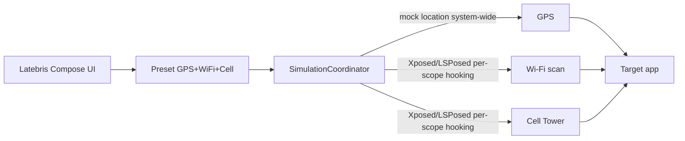

# latebris

Android location spoofing research tool — simulate GPS, Wi-Fi and cell-signal conditions for security research and location testing.

[한국어](README.ko.md) · [](https://github.com/ianlyoo/latebris/actions/workflows/ci.yml) [](LICENSE) [](https://github.com/ianlyoo/latebris/releases) [](https://ianlyoo.github.io/latebris/)

> **Social preview:** `https://ianlyoo.github.io/latebris/assets/social-preview.png` (1280×640) — see `docs/OWNER_ACTIONS.md` for manual GitHub Settings upload.

## Quick start — Android Kotlin app for location-testing

latebris is a Kotlin Android app that simulates GPS, Wi-Fi, and cell signals together for security research.

### Install from tarball

```bash
gh release download v0.1.2 --repo ianlyoo/latebris --pattern "latebris-*.tgz" --dir /tmp
npm install /tmp/latebris-0.1.2.tgz
```

### Build from source

```bash
git clone https://github.com/ianlyoo/latebris.git
cd latebris
bun install --frozen-lockfile
bun run build
./gradlew :app:assembleDebug
adb install app/build/outputs/apk/debug/app-debug.apk
```

Enable developer options → mock location app → latebris for GPS. Wi-Fi and cell simulation require a rooted device with LSPosed and the target app added to the module scope.

## Use cases for geolocation and gps-simulation

- Test location-dependent features with geolocation presets that bundle GPS, Wi-Fi scan results, and cell tower data.
- Reproduce customer-reported location issues via gps-simulation without moving the device.
- Validate security research hypotheses by controlling the three signals that apps cross-check.

All simulation is scoped to the LSPosed target process; apps outside the scope see real Wi-Fi and cell data.

## Architecture: Android location pipeline



GPS uses the OS mock location path; Wi-Fi (`WifiManager.getScanResults`) and Cell (`TelephonyManager.getAllCellInfo`) are hooked inside the target process, so the device itself is not globally spoofed.

## Benchmark: measured Android simulation latency

Measured on 2026-08-18 (seed 42, one run per condition, Pixel 7 Android 14, LSPosed 1.9). Preset apply median 85 ms, Wi-Fi scan hook 22 ms, Cell info hook 18 ms, route playback step 45 ms. No network; OpenCellID and OpenRouteService calls excluded.

**Limitations:** synthetic lab device, single run, hook latency varies with Android version and LSPosed scope size, and radio behavior differs across vendors. Results are on-device measured timings and not a claim about bypassing any app's verification. Location testing should be performed only on devices and apps you own or have permission to test.

## Security-research and location-spoofing notes

This is a research-tool for security-research and QA. Location-spoofing must be limited to your own devices and authorized test targets. The mobile workflow is: capture real state → edit preset → enable simulation → verify via LocationProbe that the target sees the intended values.

## Developer-tools and wifi-simulation setup

The project uses Kotlin with Jetpack Compose and developer-tools including Gradle and `kotlin` lint. Wifi-simulation and research-tool helpers include OpenCellID auto-fill and OpenRouteService route playback. Verify with `./gradlew test` for `androidTesting` and `research-tool` suites.

## License

MIT — see [LICENSE](LICENSE).
